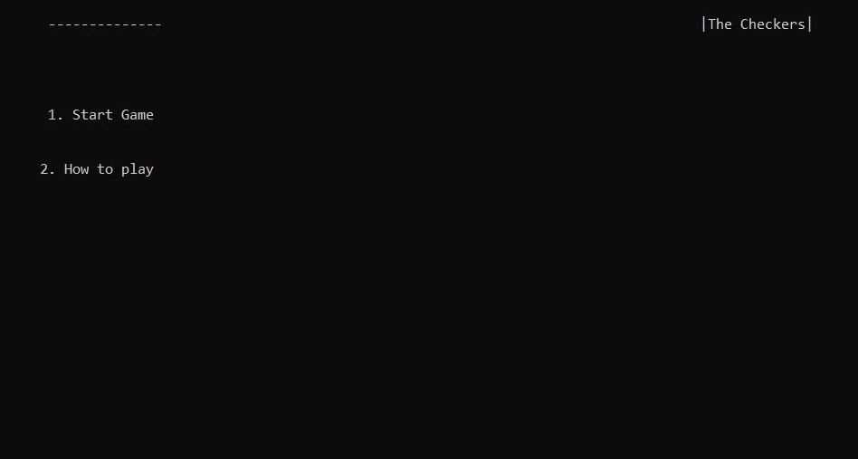
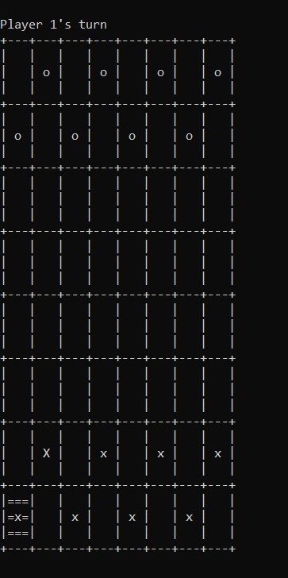

# The Checkers in C
## Computer Programming Mini Project
This Project is a part of course 06016315 Computer Programming (2018)
 * Youtube: 

# Details
### ABSTRACT
ในปัจจุบันเราไม่จำเป็นที่จะต้องฝึกทักษะด้านการคิดวิเคราะห์และแก้ปัญหาด้วยการเรียนรู้ในรูปแบบของวิชาการเพียงอย่างเดียว เราสามารถฝึกทักษะดังกล่าวได้หลากหลายวิธีมาก หนึ่งในนั้นคือการเล่นเกมที่เสริมทักษะด้านการคิดวิเคราะห์ เช่น หมากฮอส หมากรุก เป็นต้น
ทางผู้พัฒนาจึงได้ตัดสินใจที่จะพัฒนาเกม The Checkers ขึ้นมา โดยตัวเกมนั้นจะเป็นการนำหมากฮอสมาเป็นต้นแบบของเกม โดยที่ตัวเกมจะรองรับทั้งการเล่นคนเดียว (เล่นกับ Bot) และ การเล่น 2 คน
### ABOUT CHECKERS
หมากฮอส เป็นกลุ่มเกมกระดานวางแผนสำหรับผู้เล่นสองคน ซึ่งเกี่ยวข้องกับการเดินหมากเหมือนกันในแนวทแยงและการยึดบังคับโดยโดดข้ามหมากฝั่งตรงข้าม หมากฮอสพัฒนามาจาก Alquerque
### HOW TO PLAY?
__วิธีการเล่น__ ทั้ง 2 ฝ่ายจะผลัดกันเดิน หมากทุกตัวเดินเหมือนกันหมดคือเดินแบบทแยงมุมไปข้างหน้าตามช่องสีของตน เดินถอยหลังไม่ได้ เมื่อสามารถเดินไปจนสุดกระดานของอีกฝ่ายได้ หมากก็จะเปลี่ยนเป็นฮอส ความสามารถก็จะเพิ่มขึ้น คือ สามารถเดินตามแนวทแยงกี่ช่องก็ได้เมื่อเข้าฮอสแล้วก็จะนำหมากอีกตัวมาวางซ้อนกันเป็นฮอส

__การกิน__ ทำได้โดยการยกหมากข้ามหมากของฝ่ายตรงข้ามที่เดินมาชิดหมากของเราในแนวทแยงเมื่อถูกกินหมากที่ถูกกินก็จะถูกเอาออกจากกระดาน การกินจะกินครั้งละตัวหรือหลายตัวก็ได้ หากตำแหน่งของหมากตรงกับแนวเดินของเราที่สามารถกินได้

__การตัดสิน__ เมื่อฝ่ายใดถูกจับกินหมากจนหมดก็จะถือว่าแพ้หรือฝ่ายใดทางตันไม่สามารถเดินได้ต่อไปหรือเห็นว่าเดินต่อไปก็ไม่มีอนาคตแล้ว ก็จะขอยอมแพ้ก็ได้ถ้าต่างฝ่ายต่างมีหมากเหลืออยู่แต่ไม่สามารถกินกันได้ก็ถือว่าเสมอกัน
### OBJECT
__จุดประสงค์ของการเล่นหมากฮอส__ 
### FEATURE
__คุณสมบัติของเกม__ 
### RESULT
__หน้าหลักของเกม__

__หน้าในเกม__

### RELATED TECHNOLOGY
* C Programming
* 
## Group Member
61070021 นางสาวจริญญา ใจภักดี 
61070097 นายนรรณจา โสวรรณ 
61070269 นางสาวอารดา ยะรังวงษ์ 
61070346 นางสาวลลิตา สอาดเหลือ 
## REFERENCES
* http://ipatest.com/การแข่งขัน-หมากฮอส
* https://th.wikipedia.org/wiki/หมากฮอส
